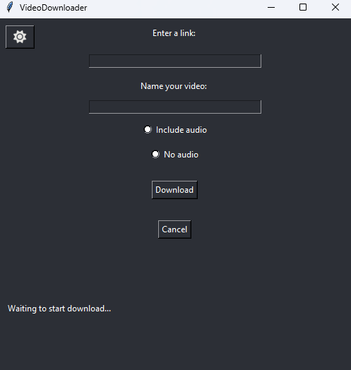

# video downloader

Python program that allows the user to download videos using a URL with support for audio options and light/dark mode
 
## Requirements
-Python 3.x
-yt-dlp
-ffmpeg
-tkinter

## Installation
1. Clone the repository:
```bash
git clone https:github.com/Luisjauregui6/video-downloader.git
```
2. Install dependencies:
```bash
pip install -r requirements.txt
```
3. Run the app:
```bash
python thedownloader.py
```

## Use:
1. Enter a video link.
2. Name your video.
3. Choose if you want audio included in your video or not.
4. Click "download".
5. Wait for the video to download.

## Screenshots



## License 

MIT License 
